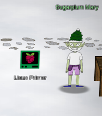

# Holiday Hack Challenge 2020: Three French Hens

## Challenges

### Kringle Kiosk (Shinny Upatree)

~~~
Welcome to our castle, we're so glad to have you with us!
Come and browse the kiosk; though our app's a bit suspicious.
Poke around, try running bash, please try to come discover,
Need our devs who made our app pull/patch to help recover?

Escape the menu by launching /bin/bash
~~~

- Determined through errors that the application was "cowsay".
- Used command injection with "&&" to add another command to the end of the file which was "bin/bash"

### Unescape Tmux (Pepper Minstix)

~~~
Can you help me?

I was playing with my birdie (she's a Green Cheek!) in something called tmux,
then I did something and it disappeared!

Can you help me find her? We were so attached!!
~~~

- Used "tmux a" to attach the available tmux session

### Linux Primer (Sugarplum Mary)

- Entered "yes" to begin
- Step 1: "ls"
- Step 2: "cat munchkin*"
- Step 3: "rm mun*"
- Step 4: "pwd"
- Step 5: "ls -al"
- Step 6: "history | grep mun"
- Step 7: "env"
- Step 8: "cd workshop"
- Step 9: 
- Step 10: "chmod +x ./lollipop_engine"
- Step 11: "mv /home/elf/workshop/electrical/blown_fuse0 /home/elf/workshop/electrical/fuse0"
- Step 12: "ln -s fuse0 fuse1"
- Step 13: "cp fuse1 fuse2"
- Step 14: "echo "MUNCHKIN_REPELLENT" >> fuse2"
- Step 15: "git status"
- Step 16: "find /opt/munchkin_den -user munchkin"
- Step 17: "find /opt/munchkin_den -size +108k -size -110k"
- Step 18: "ps aux"
- Step 19: "netstat --listen"
- Step 20: "curl localhost:54321"
- Step 21: "pkill 14516_munchkin"

### The Elf C0de (Ribb Bonbowford)

Mischevious munchkins have nabbed all the North Pole's lollipops intended for good children all over the world. Use your JavaScript skills to retrieve the nabbed lollipops from all the entrances of KringleCon.

### Redis Bug Hunt (Holly Evergreen)
~~~
We need your help!!

The server stopped working, all that's left is the maintenance port.

To access it, run:

curl http://localhost/maintenance.php

We're pretty sure the bug is in the index page. Can you somehow use the
maintenance page to view the source code for the index page?
~~~

- Step 1: "curl http://localhost/maintenance.php"
- Step 2: Notice this error output
~~~
	ERROR: 'cmd' argument required (use commas to separate commands); eg:
	curl http://localhost/maintenance.php?cmd=help
	curl http://localhost/maintenance.php?cmd=mget,example1
~~~
- Step 3: 

### Speaker UNPrep (Bushy Evergreen)
~~~
Help us get into the Speaker Unpreparedness Room!

The door is controlled by ./door, but it needs a password! If you can figure
out the password, it'll open the door right up!

Oh, and if you have extra time, maybe you can turn on the lights with ./lights
activate the vending machines with ./vending-machines? Those are a little
trickier, they have configuration files, but it'd help us a lot!

(You can do one now and come back to do the others later if you want)

We copied edit-able versions of everything into the ./lab/ folder, in case you
want to try EDITING or REMOVING the configuration files to see how the binaries
react.
	
Note: These don't require low-level reverse engineering, so you can put away IDA
and Ghidra (unless you WANT to use them!)
~~~

#### Part 1: Open the Door

- Step 1: Ran "strings door"
- Step 2: Observed this output:
~~~
	 (bytes Overflowextern "
	NulErrorBox<Any>thread 'expected, found Door opened!
	That would have opened the door!
	Be sure to finish the challenge in prod: And don't forget, the password is "Op3nTheD00r"
	Beep boop invalid password
~~~
- Step 3: entered the password after being prompted when running the "door" binary

#### Part 2: Turn on the Lights

- Step 1: "cd lab"
- Step 2: view "lights.conf" (this is where the username and password is)
- Step 3: run "./lights" and notice that 'select fields are decrypted'
	- Make note of hint from Bushy, which asks 'what if we use an encrypted username'
- Step 4: Replace username with encrypted password.
- Step 5: Run application again. Get the following result:
~~~
elf@59a34b8b05b2 ~/lab $ ./lights
The speaker unpreparedness room sure is dark, you're thinking (assuming
you've opened the door; otherwise, you wonder how dark it actually is)

You wonder how to turn the lights on? If only you had some kind of hin---

 >>> CONFIGURATION FILE LOADED, SELECT FIELDS DECRYPTED: /home/elf/lab/lights.conf

---t to help figure out the password... I guess you'll just have to make do!

The terminal just blinks: Welcome back, Computer-TurnLightsOn

What do you enter? > Computer-TurnLightsOn
Checking......
That would have turned on the lights!

If you've figured out the real password, be sure you run /home/elf/lights
~~~
- Step 6: Notice that the password/username was decrypted! ---> "Computer-TurnLightsOn"
- Step 7: Enter this password in the real "lights" binary prompt when you run it.

#### Part 3: Vending Machine

- Step 1: Rename config file.
- Step 2: Try the vending machine binary int the lab and enter a new password:
	- "CandyCane-"   encrypts to "LVEdQPpBwr" LVEdQPpBw	
	- "AAAAAAAAAAAA" encrypts to "XiGRehmwXiGR"
	- "BBBBBBBBBBBB" encrypts to "DqTpKv7fDqTp"
	- "CCCCCCCCCCCC" encrypts to "Lbn3UP9WLbn3"
	- "ABCABCABCABC" encrypts to "XqnRKPmfLiT3"
	- "DDDDDDDDDDD"  encrypts to "yv09iu8Qyv0"
	- "EEEEEEEEEEEE" encrypts to "hxkr3zCnhxkr"
	- "hhhhhhhhhhhh" encrypts to "nnUgokAhnnUg"
	- "aaaaaaaaaaaa" encrypts to "9Vbtacpg9Vbt"
        - "nnnnnnnnnnnn" encrypts to "bhE62XDBbhE6"
	- "ddddddddddddd" encryptsto "ORLdlwWbORLdl"
	- "yyyyyyyyyyyy" encrypts to "iL5JQAMUiL5J"
	- "333333333333" encrypts to "WJ1YbNtlWJ1Y"
	- "eeeeeeeeeeee" encrypts to "wcZQAYuewcZQ"
	- "ssssssssssss" encrypts to "A5PnWSbDA5Pn"
	- "123456789a"   encrypts to "2W1hYoj4lV"
	- "123456789b"   encrypts to "2W1hYoj4lU"
	- "123456789e"	 encrypts to "2W1hYoj4lc"
	- "123456789f"   encrypts to "2W1hYoj4lw"
- Step 3: I tried nearly everything but apparently skipped "CandyCane1". Wow, that was an ordeal!

### 33.6kbps (Fitzy Shortstack)

- Step 1: Dial the number --> 756-8347
- Step 2: Use the following sequence
	- baa DEE brr
	- aaah
	- WEWEWwrwrrwrr
	- beDURRdunditty
	- SCHHRRHHRTHRTR 
- Step 3: Got hint to talk to Shinny Upatree (to steal his tag ID) :)
	- "2006e22f13" 

### Scapy Prepper (Alabaster Snowball)
~~~
╔════════════════════════════════════════════════════════════════╗
║  ___ ___ ___ ___ ___ _  _ _____   ___  _   ___ _  _____ _____  ║
║ | _ \ _ \ __/ __| __| \| |_   _| | _ \/_\ / __| |/ / __|_   _| ║
║ |  _/   / _|\__ \ _|| .` | | |   |  _/ _ \ (__| ' <| _|  | |   ║
║ |_| |_|_\___|___/___|_|\_| |_|   |_|/_/ \_\___|_|\_\___| |_|   ║
║                ___                                             ║
║               | _ \_ _ ___ _ __ _ __  ___ _ _                  ║
║               |  _/ '_/ -_) '_ \ '_ \/ -_) '_|                 ║
║               |_| |_| \___| .__/ .__/\___|_|                   ║
║                           |_|  |_|                             ║
║                (Packets prepared with scapy)                   ║
╚════════════════════════════════════════════════════════════════╝
Type "yes" to begin. 
~~~

### CAN-Bus Investigation (Wunorse Openslae)
~~~
Welcome to the CAN bus terminal challenge!

In your home folder, there's a CAN bus capture from Santa's sleigh. Some of
the data has been cleaned up, so don't worry - it isn't too noisy. What you
will see is a record of the engine idling up and down. Also in the data are
a LOCK signal, an UNLOCK signal, and one more LOCK. Can you find the UNLOCK?
We'd like to encode another key mechanism.

Find the timestamp of the UNLOCK code in candump.log and submit it to
./runtoanswer!
~~~
- Step 1: "awk '/19B/' candump.log
- Step 2: Read through list of results 
- Step 3: Start from the bottom and work my way up until getting right time stamp. :)

~~~
elf@d08e90349b0f:~$ awk '/19B/' candump.log
(1608926661.626380) vcan0 244#000000019B
(1608926662.390980) vcan0 244#000000019B
(1608926664.626448) vcan0 19B#000000000000
(1608926667.837300) vcan0 244#00000019BE
(1608926671.122520) vcan0 19B#00000F000000
(1608926673.157900) vcan0 244#00000019BE
(1608926674.092148) vcan0 19B#000000000000
elf@d08e90349b0f:~$ ./runtoanswer 
There are two LOCK codes and one UNLOCK code in the log.  What is the decimal portion of the UNLOCK timestamp?
(e.g., if the timestamp of the UNLOCK were 1608926672.391456, you would enter 391456.
> 092148
Your answer: 092148

Checking....
Sorry, that answer is incorrect. Please try again!
elf@d08e90349b0f:~$ ./runtoanswer 
There are two LOCK codes and one UNLOCK code in the log.  What is the decimal portion of the UNLOCK timestamp?
(e.g., if the timestamp of the UNLOCK were 1608926672.391456, you would enter 391456.
> 122520
Your answer: 122520

Checking....
Your answer is correct!
~~~

## Objective No. 1: Uncover Santa's Gift List

There is a photo of Santa's Desk on that billboard with his personal gift list. What gift is Santa planning on getting Josh Wright for the holidays? Talk to Jingle Ringford at the bottom of the mountain for advice.

There is a photo of Santa's Desk on that billboard with his personal gift list. What gift is Santa planning on getting Josh Wright for the holidays? Talk to Jingle Ringford at the bottom of the mountain for advice.

- First stop in the Holiday Hack challenge! I talked to Jingle Ringleford and downloaded the billboard image.
- I used the tool suggested in the hint. Took several attempts at twirling and untwirling before I could see what was on the list for him.
- Once I saw what was on the list, I read it as "poxmark", but had no idea if this was a thing, so I googled it. YUP! A very interesting thing at that. :)

## Objective No. 2: Investigate S3 Bucket

When you unwrap the over-wrapped file, what text string is inside the package? Talk to Shinny Upatree in front of the castle for hints on this challenge.

- Added wrapper3000 to the wordlist
- Found this bucket (wrapper3000) and the file "package"
- Now attempting to decompress the file
- <a href="http://s3.amazonaws.com/wrapper3000/package">http://s3.amazonaws.com/wrapper3000/package</a>
- Step 1: "cat package" (and see that it was base64 encoded)
- Step 2: "base64 -d package > package.zip"
- Step 3: "unzip package.zip"
- Step 4: "tar -xvf package.txt.Z.xz.xxd.tar.bz2"
- Step 5: "xxd -r *.xxd > package.txt.Z.xz"
- Step 6: "xz -d package.txt.Z.xz"
- Step 7: "uncompress package.txt.Z"
- Step 8: "cat package.txt"
- Step 9: Find the answer! ---> "North Pole: The Frostiest Place on Earth"

## Objective No. 3: Point-of-Sale Password Recovery

Help Sugarplum Mary in the Courtyard find the supervisor password for the point-of-sale terminal. What's the password?

- Step 1: Download the santa-shop.exe file.
- Step 2: Extract with "engrampa"
	
- Step 3: Looking at the .asar file located here:  /home/kali/Downloads/app-64/resources
- Step 4: Remember to read hints and look at hint suggesting npm "asar" tool.
- Step 5: Reading throught this article on how to use it. Interesting!
	- Follow directions and unpack source code for santa-shop.exe
	- <a href="https://medium.com/how-to-electron/how-to-get-source-code-of-any-electron-application-cbb5c7726c37">asar article on Medium</a>

- Step 6: Review unpacked source code and then "cat README.md"
	- "cat README.md" ---> "Remember, if you need to change Santa's passwords, it's at the top of main.js!"
- Step 7: Find the answer! ---> "santapass"
~~~
main.js
// Modules to control application life and create native browser window
const { app, BrowserWindow, ipcMain } = require('electron');
const path = require('path');

const SANTA_PASSWORD = 'santapass';
~~~

## Objective No. 4: Operate the Santavator

Talk to Pepper Minstix in the entryway to get some hints about the Santavator.

Got some help from my kid on this one. :) 

## Objective No. 5: Open HID Lock

Open the HID lock in the Workshop. Talk to Bushy Evergreen near the talk tracks for hints on this challenge. You may also visit Fitzy Shortstack in the kitchen for tips.

- Step 1: Get this RFID: 2006e22ee1 (from the ? room)
- Step 2: Sim HID tag: "lf hid sim -r 2006e22ee1" 
- Step 3: Realize that tag ID doesn't do anything.
- Step 4: Steal Shinny Upatree's ID, using "search lf" when standing next to him.
- Step 5: Simulate the ID when you get to Santa's secret door in the workshop.
        - "lf hid sim -r 2006e22f13" 
	- Needed to wait seconds. I was being boneheaded and trying the door before the 10 seconds was up.
- Step 6: Go through Santa's secret office and BECOME SANTA! WHAT ON EARTH!

## Objective No. 6: Splunk Challenge

Access the Splunk terminal in the Great Room. What is the name of the adversary group that Santa feared would attack KringleCon?

Make sure you are "Santa" when you attempt this objective.

### Question 1

How many distinct MITRE ATT&CK techniques did Alice emulate?

- Step 1: Visit the "Alice Bluebird" chat. Notice this search string:
	" | tstats count where index=* by index "
- Step 2: Use this search string in the "Search" page.
- Step 3: Then simply set the search to "index=attack" (switch to verbose mode)
- Step 4: Find the count for the field called "Test Number"
- Answer: 13

This was the recommended search
~~~
| tstats count where index=* by index 
| search index=T*-win OR T*-main
| rex field=index "(?<technique>t\d+)[\.\-].0*" 
| stats dc(technique)
~~~

### Question 2

What are the names of the two indexes that contain the results of emulating Enterprise ATT&CK technique 1059.003? (Put them in alphabetical order and separate them with a space)

- Step 1: Read response from "Alice Bluebird"
- Step 2: Use this search again: 
~~~
| tstats count where index=* by index
~~~
- Step 3: Notice the two indexes that start with 1059.003
- Answers: 
	- t1059.003-main
	- t1059.003-win

### Question 3

One technique that Santa had us simulate deals with 'system information discovery'. What is the full name of the registry key that is queried to determine the MachineGuid?    
- Step 1: Notice that this is t1082
- Step 2: Try this is the search "index=t1082-win"
- Step 3: Go here: https://github.com/redcanaryco/atomic-red-team/search?p=2&q=system+information
- Step 4: Find the answer on this page: https://github.com/redcanaryco/atomic-red-team/blob/8eb52117b748d378325f7719554a896e37bccec7/atomics/T1082/T1082.md
- Answer: "HKEY_LOCAL_MACHINE\SOFTWARE\Microsoft\Cryptography"

### Question 4

According to events recorded by the Splunk Attack Range, when was the first OSTAP related atomic test executed? (Please provide the alphanumeric UTC timestamp.)

- Step 1: Search "index=attack"
- Step 2: Sort "execution time" desc.
- Step 3: Find first instance of OSTAP
- Answer: "2020-11-30T17:44:15Z" (OSTAP Worming Activity)

### Question 5

One Atomic Red Team test executed by the Attack Range makes use of an open source package authored by frgnca on GitHub. According to Sysmon (Event Code 1) events in Splunk, what was the ProcessId associated with the first use of this component?

- Step 1: Look up the events in the "index=attack" list. 
- Step 2: Notice the test called "using device audio capture commandlet"
- Step 3: Notice the local execution time (2020-11-30T19:25:14) 
- Step 4: Go back and search with "index=* EventID=1"
- Step 5: *Find the time in the range in the Timeline.
- Step 6: Find the event that matches. 
	- (powershell command with the commandlet in it) (row 30)
- Answer: 3648 (ProcessId)

### Question 6

Alice ran a simulation of an attacker abusing Windows registry run keys. This technique leveraged a multi-line batch file that was also used by a few other techniques. What is the final command of this multi-line batch file used as part of this simulation?

- Step 1: Use this filter 'index=* file_name="*.bat"'
- Step 2: Make note of all the bat files.
- Step 3: Review a sample of them in the Atomic Red Team repo.
- Step 4: Find one that is multiline effecting registry values.
- Step 5: Discover that this is discovery.bat
- Answer: "quser"

### Question 7

According to x509 certificate events captured by Zeek (formerly Bro), what is the serial number of the TLS certificate assigned to the Windows domain controller in the attack range?

- Step 1: Use this filter 'index=* sourcetype=bro*"
- Step 2: See values for certificate.serial
- Step 3: Pick the most heavily used serial since this is a domain controller.
- Answer: 55FCEEBB21270D9249E86F4B9DC7AA60

### Challenge Question

- Step 1: Google "RFC 7465" to see what Alice talking about.
- Step 2: Looks like RC4 encryption.
- Step 3: Go to CyberChef and see what I need. A Passphrase.
- Step 4: Alice says I need to watch Splunk talk.
	- Passphrase is "Stay Frosty"
- Answer: "The Lollipop Guild"

## Objective 7: Solve the Sleight's CAN-D-BUS Problem

Jack Frost is somehow inserting malicious messages onto the sleigh's CAN-D bus. We need you to exclude the malicious messages and no others to fix the sleigh. Visit the NetWars room on the roof and talk to Wunorse Openslae for hints.

- Step 1: Filter out all the zero values currently running.
	- Example 244#000000000000 	

- Step 2: Notice what some of the controls do once all the zeros are filtered.
~~~
	START     -> 02A#00FF00
	STOP      -> 02A#0000FF
	LOCK      -> 19B#000000000000
	UNLOCK    -> 19B#00000F000000
	STEERINGR -> 019#00000001
	STEERINGL -> 019#FFFFFFFF
	BRAKE     -> 080#000001
	ACCEL	  -> 244#

	JUNK? --> 080#FFFFFA
	JUNK? --> 19B#0000000F2057
~~~
- Step 3: Notice the some junky values that don't make sense.
	- Why are there negative values for brakes??
	- Why is there a lock/unlock value that presents a third state??
- Step 4: Use these filters

It works!

